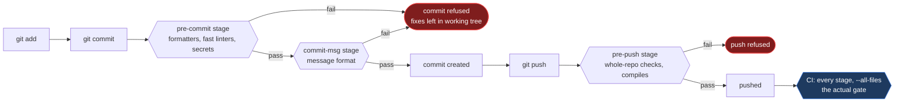
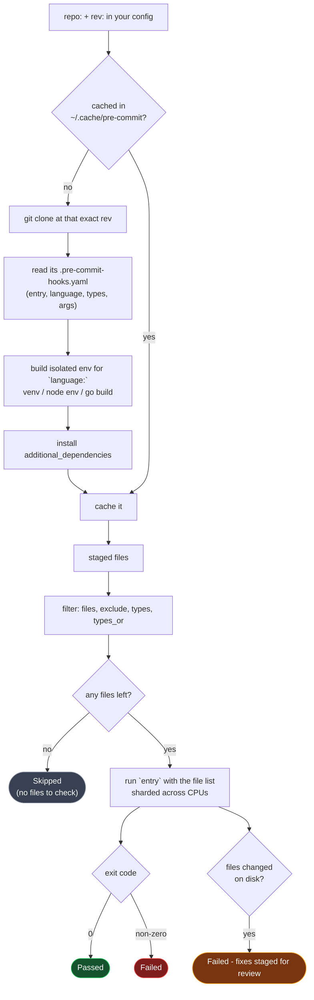

# How pre-commit works

A mental model first, then a real commit traced end to end, then what you
actually get out of it.

## The one-sentence version

pre-commit installs a script into `.git/hooks/`, and when git runs that script
it works out which of your staged files each configured hook cares about, runs
those hooks in isolated environments it built and cached itself, and refuses the
commit if any of them complain.

## Where the hooks sit

Git fires four of its native hooks at points you care about. pre-commit puts
itself in each one, and your config decides which of your hooks run where.



The `manual` stage is deliberately absent from that diagram: nothing fires it
automatically. It exists for hooks you want configured, versioned and available
— `clang-tidy`, `checkov`, `pip-audit` — but never on someone's commit path.
You run those in CI, or by hand.

Which stage to put a hook in is its own decision with its own trade-offs; see
[stages.md](stages.md).

## What one hook actually does

The part that surprises people is that pre-commit is a package manager as well
as a runner. It clones each hook repository, builds a **fully isolated
environment** for it, and caches that under `~/.cache/pre-commit`.



Three consequences fall straight out of that picture, and they explain most
confusion people have with the tool:

1. **The isolated environment cannot see your project's dependencies.** That is
   why `mypy` needs `additional_dependencies: [types-requests]` and why an
   ESLint plugin has to be declared in the hook as well as in `package.json`.
   See [troubleshooting.md](troubleshooting.md).
2. **`rev:` pins the tool, not just the config.** Everyone on the team and CI
   run the identical binary, which is what makes "it formats differently on my
   machine" go away.
3. **A hook that matches no files is `Skipped`, and skipped looks like
   success.** A wrong `files:` regex fails open — the most common way a hook
   silently does nothing for a year.

## A commit, traced

Say you edit two files and commit.

**1. Stage the work.** Hooks only ever see what is staged. An unstaged change is
invisible to them, and this is the single most common "but it passed locally"
cause.

```bash
git add stacks/python/src/tempconv/converter.py stacks/terraform/main.tf
```

**2. Commit.** Git runs `.git/hooks/pre-commit`, which hands control to
pre-commit.

```bash
git commit -m "feat: add kelvin conversion"
```

**3. pre-commit stashes anything unstaged.** So a hook can never pass because of
a change you did not commit. It is restored afterwards.

**4. Each hook filters the two staged files.** This is why a small commit is
fast — the Terraform hooks never see the Python file, and 40 of the 50 hooks in
a large config have nothing to do at all:

```text
trailing-whitespace......................................Passed
check-yaml...........................(no files to check)Skipped
ruff-check...............................................Passed
ruff-format..............................................Passed
mypy.....................................................Passed
terraform_fmt............................................Failed
- hook id: terraform_fmt
- files were modified by this hook
```

**5. A formatter rewrote a file, so the commit is refused.** This is correct
behaviour, not a bug. The fix is sitting in your working tree; a hook that
silently rewrote and committed would mean shipping code you never looked at:

```bash
git diff          # see exactly what it changed
git add -u        # accept it
git commit -m "feat: add kelvin conversion"
```

**6. Hooks pass, so the `commit-msg` stage runs** against your message.
`feat: ...` satisfies conventional commits, so the commit is created.

**7. On `git push`,** the `pre-push` hooks run — the whole-repo consistency
checks that are not worth paying for on each of the twelve commits in a branch.

**8. CI runs everything over every file.** Local hooks are a fast feedback loop,
not a gate: `--no-verify` exists, and the GitHub web editor has no hooks at all.
The required status check is the actual enforcement point.

### Escape hatches, in order of preference

```bash
SKIP=terraform_fmt git commit -m "..."   # skip one named hook
git commit --no-verify                   # skip everything
```

Prefer `SKIP`. It names what was bypassed, leaves every other hook working, and
is visible in shell history. If a hook lives permanently in someone's `SKIP`
list, that is a signal the hook is at the wrong stage, or is simply wrong.

## What you get for it

**Review stops being about whitespace.** Formatting is settled mechanically
before the diff exists, so review comments are about the change. This is the
benefit people notice first and underrate most — it removes an entire genre of
bikeshedding from your team's day.

**Secrets never reach the remote.** `gitleaks` and `detect-private-key` cost
milliseconds. A leaked credential costs a rotation, an audit, and sometimes a
disclosure — and once it is pushed to a shared remote, deleting it does not help;
[you have to rotate it](adoption.md). This one hook justifies the whole setup.

**The feedback loop collapses from minutes to seconds.** Finding a missing
newline via a five-minute CI run, a context switch and a fixup commit is a
terrible trade against finding it in 200ms.

**Everyone runs the same tool version.** `rev:` pins it and pre-commit installs
it, so two developers cannot reformat each other's files back and forth forever
because one has clang-format 17 and the other 19.

**Onboarding is one line.** `pre-commit install --install-hooks` and a new
contributor has the entire toolchain, correctly versioned, without reading a
wiki page about which linters to install.

**One runner for a polyglot repo.** The same command checks Terraform, Helm,
Python and C#. Without it you accumulate a bespoke CI step per language, each
configured slightly differently from what runs locally.

**Config lives with the code.** Reviewed, versioned, bisectable. When a rule
changes you can see who changed it and why.

### What it does not give you

Worth being straight about:

- **It is not a security boundary.** `--no-verify` is one flag. CI is the gate.
- **It is not a test suite.** Hooks run per-file in seconds; if it needs your
  whole test suite, it is not a commit hook.
- **It is not free.** You are adding a dependency, a cache, and a class of
  "works on my machine" problems around isolated environments. The
  [troubleshooting guide](troubleshooting.md) exists because these are real.
- **Adoption on an existing codebase costs a big diff.** Plan it —
  [adoption.md](adoption.md).

## Next

- [Choosing a stage](stages.md) — where each hook belongs and why
- [Two patterns](two-patterns.md) — one root config vs one per project
- [Writing your own hooks](writing-custom-hooks.md)
- [Running it in CI](ci-integration.md)
- [Troubleshooting](troubleshooting.md)
